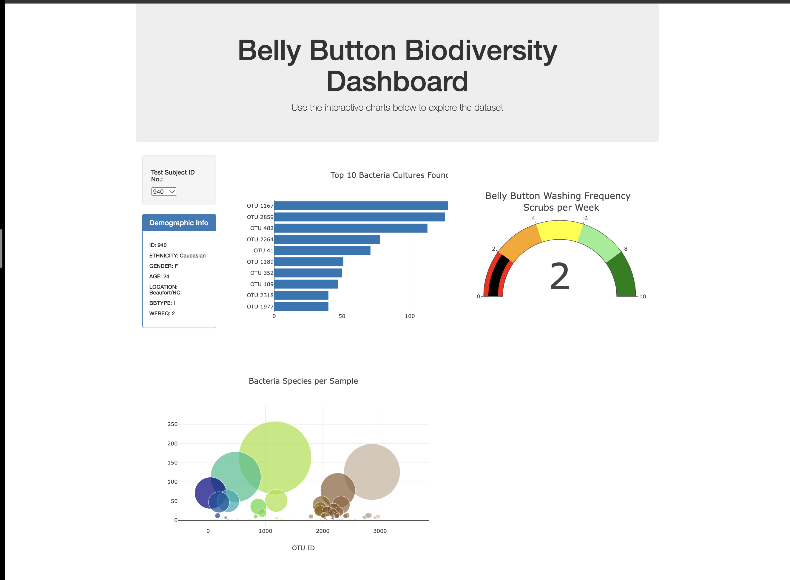

# Button Biodiversity

[Deployed URL](https://hakeem235.github.io/button_biodiversity/)

The goal of this analysis is to create a dynamic panel containing demographics and microbial data for each volunteer. The analysis includes her three charts:
A bar chart showing the top 10 bacterial cultures found on the belly button, a bubble chart showing the number of bacterial cultures per sample, and a gauge chart showing how often volunteers wash their belly button. By selecting the volunteer (UTO ID) from the drop-down menu, you can see the difference between multiple subjects.

